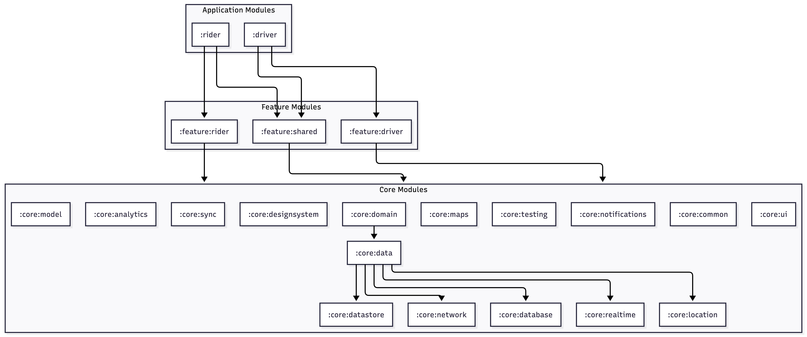
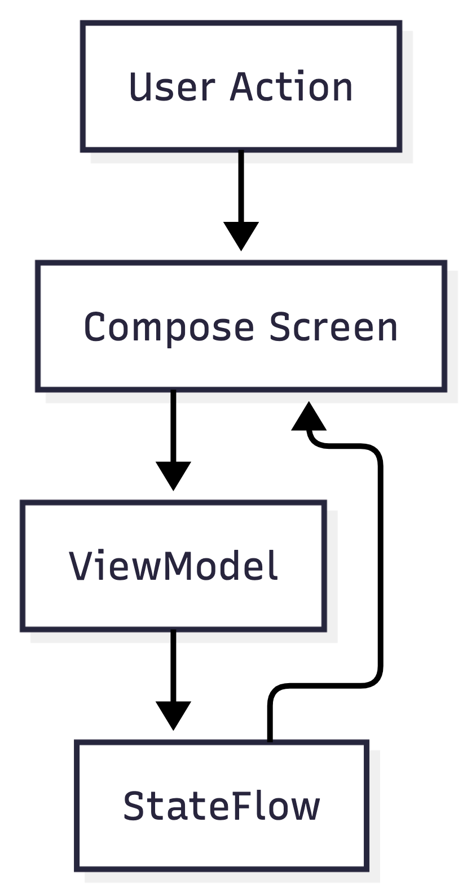
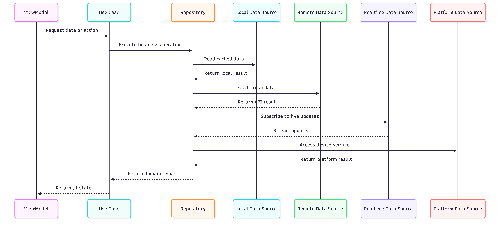
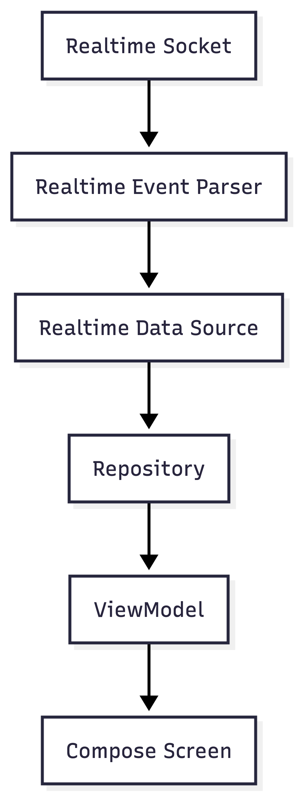
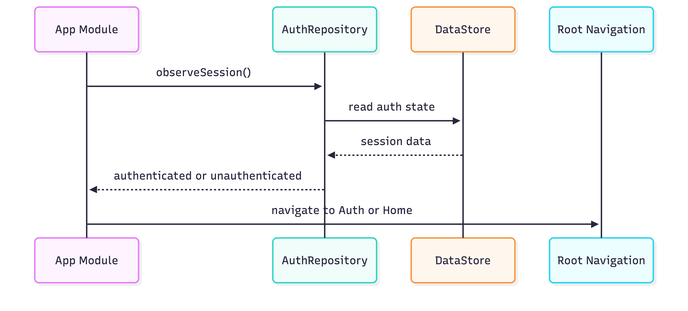
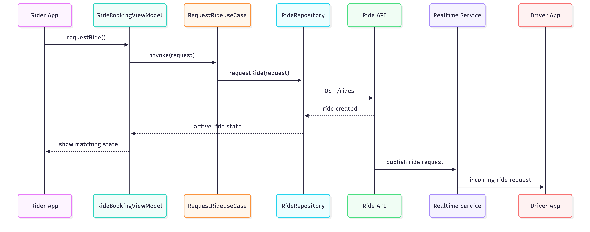
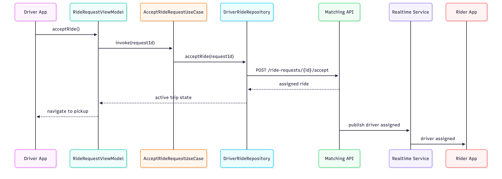

# OpenRide Africa Android Architecture

OpenRide Africa is a two-app Android platform.

```text
:app:rider
:app:driver
```

The Rider app and Driver app are separate Android applications because they solve different workflows, but they share the same foundation through shared core modules.

## 1. Architecture goals

The architecture should support:

```text
Two separate Android apps
Shared core infrastructure
Feature-based modularization
Jetpack Compose UI
Kotlin Coroutines and Flow
Offline-first data where practical
Realtime ride updates
Scalable navigation
Testable business logic
Clear dependency boundaries
```

---

## 2. High-level architecture



---

## 3. Main layers

The app uses three main layers:

```text
UI layer
Domain layer
Data layer
```

---

## 4. UI layer

The UI layer contains:

```text
Jetpack Compose screens
Navigation routes
ViewModels
UI state
UI events
Small UI mappers
```

The UI layer should not call APIs, databases, sockets, maps SDKs, or location providers directly.

Screens send user events to ViewModels.

ViewModels expose state to screens.



Example feature structure:

```text
RiderHomeRoute.kt
RiderHomeScreen.kt
RiderHomeViewModel.kt
RiderHomeUiState.kt
```

---

## 5. Domain layer

The domain layer contains use cases.

Use cases hold reusable business logic that should not live directly inside ViewModels.

Examples:

```text
RequestRideUseCase
CancelRideUseCase
ObserveActiveRideUseCase
GetFareEstimateUseCase
ObserveNearbyDriversUseCase
GoOnlineUseCase
GoOfflineUseCase
AcceptRideRequestUseCase
CompleteTripUseCase
GetDriverEarningsUseCase
```

Use cases should be small and focused.

A use case may combine data from multiple repositories.

---

## 6. Data layer

The data layer contains repositories and data sources.

Repositories are the public API for app data.

The rest of the app should access data through repositories, not directly through Retrofit, Room, DataStore, WebSocket, location, or maps APIs.



---

## 7. Data flow rule

```text
Events flow down
Data flows up
```

Example ride request flow:

```text
User taps Request Ride
Screen calls ViewModel
ViewModel calls RequestRideUseCase
Use case calls RideRepository
Repository calls API and saves local state
Repository exposes updated ride state as Flow
ViewModel converts Flow into UI state
Screen renders the new state
```

---

## 8. Rider app

```text
:rider
```

The Rider app owns rider-specific navigation and app setup.

Rider app responsibilities:

```text
Rider MainActivity
Rider Application class
Rider root navigation
Rider top-level destinations
Rider deep links
Rider notification routing
Rider permissions
Rider release configuration
```

Rider features:

```text
:feature:rider:home
:feature:rider:destination-search
:feature:rider:ride-booking
:feature:rider:ride-matching
:feature:rider:ride-tracking
:feature:rider:rider-payment
:feature:rider:rider-safety
:feature:rider:rider-rating
```

Rider journey:

```text
Open app
Select pickup
Search destination
View fare estimate
Choose ride type
Request ride
Wait for driver
Track driver arrival
Start trip
Track trip
Pay
Rate driver
View receipt
```

---

## 9. Driver app

```text
:driver
```

The Driver app owns driver-specific navigation and app setup.

Driver app responsibilities:

```text
Driver MainActivity
Driver Application class
Driver root navigation
Driver top-level destinations
Driver deep links
Driver foreground location service setup
Driver notification routing
Driver permissions
Driver release configuration
```

Driver features:

```text
:feature:driver:driver-home
:feature:driver:driver-availability
:feature:driver:ride-request
:feature:driver:driver-navigation
:feature:driver:active-trip
:feature:driver:driver-earnings
:feature:driver:driver-wallet
:feature:driver:vehicle-documents
:feature:driver:driver-rating
```

Driver journey:

```text
Open app
Go online
Start location publishing
Receive ride request
Accept or reject request
Navigate to pickup
Arrive at pickup
Start trip
Navigate to destination
Complete trip
View earnings
Manage wallet
```

---

## 10. Shared features

Shared features are used by both apps.

```text
:feature:shared:auth
:feature:shared:profile
:feature:shared:trip-history
:feature:shared:support
:feature:shared:notifications
```

These features should contain user journeys that are common to both Rider and Driver apps.

---

## 11. Core modules

Core modules provide shared platform and business infrastructure.

```text
:core:model
:core:common
:core:designsystem
:core:ui
:core:domain
:core:data
:core:network
:core:database
:core:datastore
:core:realtime
:core:location
:core:maps
:core:notifications
:core:sync
:core:analytics
:core:testing
```

---

## 12. Realtime architecture

Ride hailing needs realtime updates.

The realtime layer should handle:

```text
Socket connection
Authentication
Reconnect logic
Ride status updates
Driver location updates
Incoming ride requests
Matching events
Trip completion events
```

Realtime events should be exposed as Kotlin Flows.



---

## 13. Offline-first approach

Use offline-first where it makes sense.

Good offline-first data:

```text
User profile
Saved places
Trip history
Receipts
Driver earnings history
Vehicle documents metadata
Support drafts
Pending ratings
Last active trip snapshot
```

Network-first or realtime-first data:

```text
Ride matching
Live driver location
Driver availability
Fare surge
Payment authorization
Trip start
Trip completion
Safety events
```

---

## 14. Repository examples

```kotlin
interface RideRepository {
    fun observeActiveRide(): Flow<Ride?>
    fun observeRideStatus(rideId: RideId): Flow<RideStatus>
    suspend fun requestRide(request: RideRequest): Result<Ride>
    suspend fun cancelRide(rideId: RideId): Result<Unit>
}
```

```kotlin
interface DriverAvailabilityRepository {
    fun observeAvailability(): Flow<DriverAvailability>
    suspend fun goOnline(): Result<Unit>
    suspend fun goOffline(): Result<Unit>
}
```

```kotlin
interface DriverLocationRepository {
    fun observeCurrentLocation(): Flow<LocationPoint?>
    suspend fun publishDriverLocation(location: LocationPoint): Result<Unit>
}
```

---

## 15. App startup flow



---

## 16. Ride request flow



---

## 17. Driver accept flow



---

## 18. Testing strategy

Test at the right layer.

```text
Use case tests
Repository tests
ViewModel tests
Navigation tests
UI screenshot tests
Database tests
Realtime data source tests
Location abstraction tests
```

Use fake repositories and fake data sources for feature tests.

Use real Room and DataStore only where integration testing is required.

---

## 19. Main rules

```text
App modules stay thin
Feature modules own user journeys
Core modules own shared infrastructure
UI talks to ViewModels
ViewModels talk to use cases or repositories
Repositories coordinate data sources
Data is exposed with Flow
Events move downward
State moves upward
```
