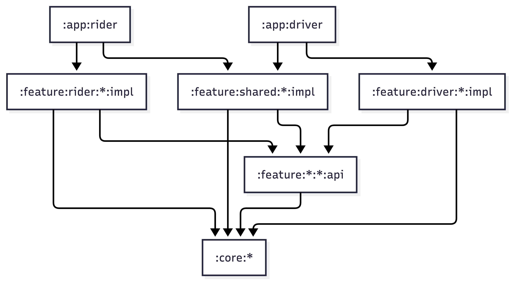

# OpenRide Africa Android Modularization

OpenRide Africa uses one Android monorepo with two app modules.

```text
:rider
:driver
```

The goal is to keep the Rider and Driver apps separate while sharing common Android infrastructure.

This modularization approach follows the same broad direction for Modern Android Development (MAD) architecture

- app modules assemble final apps
- feature modules own user-facing journeys
- core modules provide reusable infrastructure
- dependencies flow inward toward core
- app and feature modules should not create circular dependencies

---

## 1. Main structure

```text
openrideafrica-android/
  rider/
  driver/

  core/
    model/
    common/
    designsystem/
    ui/
    domain/
    data/
    network/
    database/
    datastore/
    realtime/
    location/
    maps/
    notifications/
    sync/
    analytics/
    testing/

  feature/
    shared/
    rider/
    driver/

  build-logic/
  docs/
```

---

## 2. Module groups

```text
app modules
core modules
feature modules
build logic
docs folder
```

---

## 3. App modules

```text
:rider
:driver
```

App modules are the final Android applications.

They own:

```text
MainActivity
Application class
Root navigation
App scaffolding
Top level destinations
Deep links
App specific permissions
App specific build configuration
```

The app modules should not contain business logic.

The app modules should depend on feature implementation modules and the few core modules needed for app setup.

---

## 4. Core modules

Core modules are shared by both apps.

```text
:core:model
:core:common
:core:designsystem
:core:ui
:core:domain
:core:data
:core:network
:core:database
:core:datastore
:core:realtime
:core:location
:core:maps
:core:notifications
:core:sync
:core:analytics
:core:testing
```

Core modules must not depend on app modules.

Core modules must not depend on feature modules.

---

## 5. Feature modules

Feature modules contain product journeys.

They are grouped by role.

```text
:feature:shared
:feature:rider
:feature:driver
```

---

## 6. Shared feature modules

Shared features are used by both Rider and Driver apps.

```text
:feature:shared:auth:api
:feature:shared:auth:impl

:feature:shared:profile:api
:feature:shared:profile:impl

:feature:shared:trip-history:api
:feature:shared:trip-history:impl

:feature:shared:support:api
:feature:shared:support:impl

:feature:shared:notifications:api
:feature:shared:notifications:impl
```

---

## 7. Rider feature modules

```text
:feature:rider:home:api
:feature:rider:home:impl

:feature:rider:destination-search:api
:feature:rider:destination-search:impl

:feature:rider:ride-booking:api
:feature:rider:ride-booking:impl

:feature:rider:ride-matching:api
:feature:rider:ride-matching:impl

:feature:rider:ride-tracking:api
:feature:rider:ride-tracking:impl

:feature:rider:rider-payment:api
:feature:rider:rider-payment:impl

:feature:rider:rider-safety:api
:feature:rider:rider-safety:impl

:feature:rider:rider-rating:api
:feature:rider:rider-rating:impl
```

---

## 8. Driver feature modules

```text
:feature:driver:driver-home:api
:feature:driver:driver-home:impl

:feature:driver:driver-availability:api
:feature:driver:driver-availability:impl

:feature:driver:ride-request:api
:feature:driver:ride-request:impl

:feature:driver:driver-navigation:api
:feature:driver:driver-navigation:impl

:feature:driver:active-trip:api
:feature:driver:active-trip:impl

:feature:driver:driver-earnings:api
:feature:driver:driver-earnings:impl

:feature:driver:driver-wallet:api
:feature:driver:driver-wallet:impl

:feature:driver:vehicle-documents:api
:feature:driver:vehicle-documents:impl

:feature:driver:driver-rating:api
:feature:driver:driver-rating:impl
```

---

## 9. API and implementation split

Each serious feature should be split into two modules.

```text
:feature:rider:ride-booking:api
:feature:rider:ride-booking:impl
```

The `api` module exposes only the public contract.

Examples:

```text
Navigation route
Navigation extension function
Stable feature contract
Small public model if needed
```

The `impl` module contains the implementation.

Examples:

```text
Compose screens
ViewModels
UI state
UI events
Internal UI components
Feature mappers
Feature-specific dependency injection
```

---

## 10. Why use api and impl modules

This keeps implementation details private.

Other modules can depend on feature contracts without depending on feature internals.

This helps prevent accidental coupling between features.

It also makes navigation cleaner because app modules can wire feature graphs without exposing internal screen details everywhere.

---

## 11. Dependency direction



---

## 12. Allowed dependencies

```text
:app:rider
    may depend on rider feature impl modules
    may depend on shared feature impl modules
    may depend on core modules needed for app setup

:app:driver
    may depend on driver feature impl modules
    may depend on shared feature impl modules
    may depend on core modules needed for app setup

:feature:*:*:impl
    may depend on its own api module
    may depend on core modules
    may depend on another feature api module for navigation only

:feature:*:*:api
    may depend on core model
    may depend on core common only if needed

:core:data
    may depend on core model
    may depend on core common
    may depend on core network
    may depend on core database
    may depend on core datastore
    may depend on core realtime
    may depend on core location

:core:domain
    may depend on core model
    may depend on core data

:core:ui
    may depend on core model
    may depend on core designsystem

:core:model
    should be pure Kotlin
```

---

## 13. Forbidden dependencies

```text
core depending on app
core depending on feature
feature api depending on feature impl
rider feature impl depending on driver feature impl
driver feature impl depending on rider feature impl
UI depending directly on network
UI depending directly on database
UI depending directly on datastore
```

---
